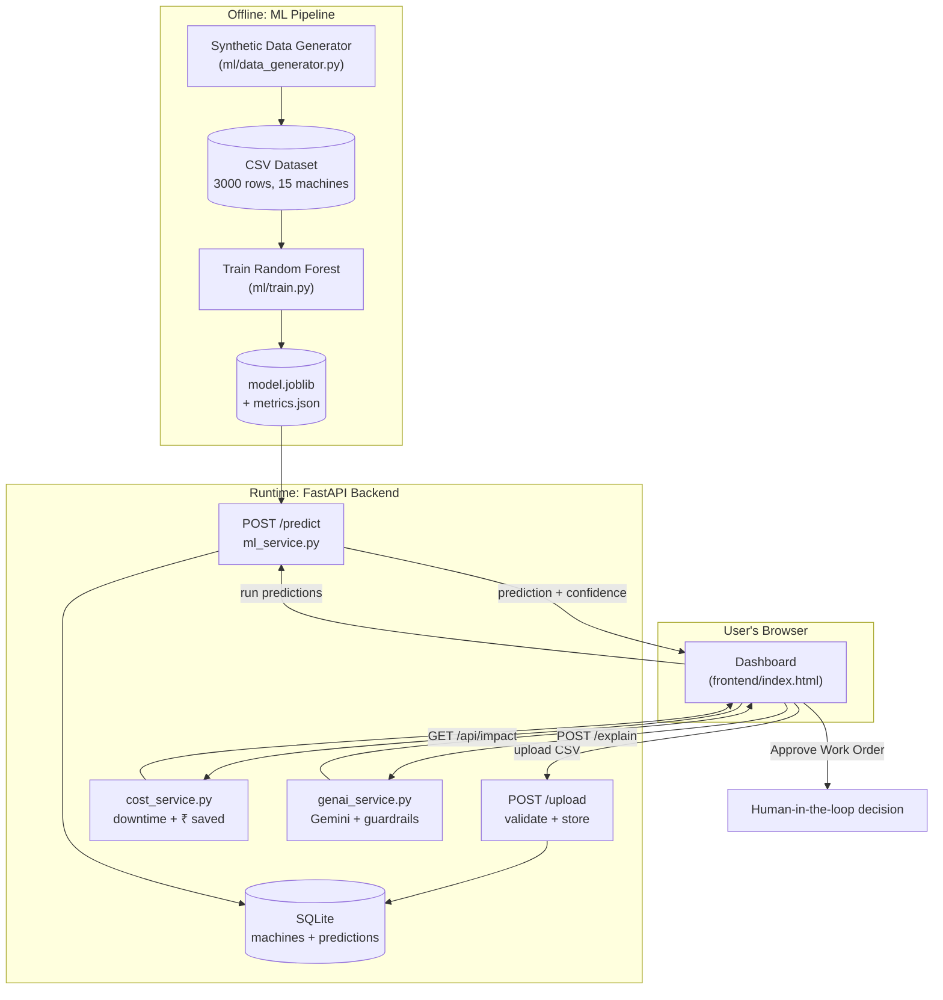
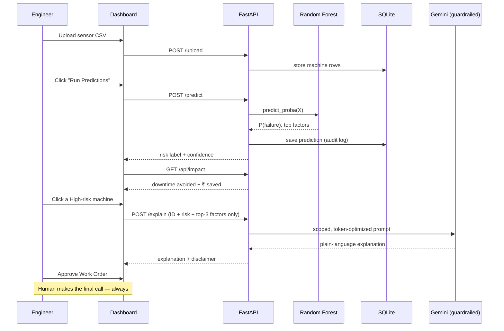

<div align="center">

<pre style="display: inline-block; text-align: left; font-weight: bold; background: none; border: none; padding: 0;">
 ██████╗ ███████╗███╗   ███╗███████╗
 ██╔══██╗██╔════╝████╗ ████║██╔════╝
 ██████╔╝█████╗  ██╔████╔██║███████╗
 ██╔═══╝ ██╔══╝  ██║╚██╔╝██║╚════██║
 ██║     ███████╗██║ ╚═╝ ██║███████║
 ╚═╝     ╚══════╝╚═╝     ╚═╝╚══════╝
</pre>

<br>

**Predict the breakdown. Prevent the downtime.**

[](#)
[](#)
[](#)
[](ml/README.md)
[](backend)
[](#)
[](#genai-setup)
[](#)

*Built at Cognizant Hackathon 2026 by Team 4Script*

</div>

---

## 🔥 The Problem

Industrial machines fail without warning. A breakdown means unplanned downtime,
emergency repairs, and lost production — all far more expensive than a
scheduled service would have been.

**PEMS fixes this.** It watches sensor readings, tells maintenance engineers
*which* machines are at risk *before* they fail, explains *why* in plain
language, and shows the rupee value of acting early. The engineer stays in
control — the AI only recommends.

---

## ✨ What It Does

PEMS is an **AI-powered predictive maintenance MVP** — a full pipeline from
synthetic sensor data to a decision-support dashboard.

1. **Generates realistic sensor data** — 15 machines, 4 types, physics-correlated
   degradation (temperature, vibration, current, load all rise together as a
   machine fails), engineering-rule failure labels, injected anomalies
2. **Trains a Random Forest** — 200 trees, leakage-safe features, evaluated on
   a held-out test set (0.97 F1, 0.999 ROC-AUC)
3. **Serves predictions via FastAPI** — upload a CSV of live sensor snapshots,
   get back failure probability, risk tier, and top contributing factors
4. **Explains with GenAI (guardrailed)** — Gemini turns the raw prediction into
   a plain-language recommendation, with a safe fallback template if no API
   key is configured
5. **Quantifies business impact** — expected-value cost model converts
   "prevented breakdown" into downtime hours and rupees saved
6. **Dashboard** — upload → predict → ranked risk table → business impact →
   AI explanation → human approves the work order

One CSV upload. Ranked risk table. Plain-language reasoning. Rupees saved.
Human always approves.

---

## 🏗️ Architecture



**Three golden rules:**
- The **frontend never touches the database** — only through the API.
- The **LLM is never the source of truth** — ML predicts, GenAI only explains.
- The **model loads once at startup** — never retrains per request.

### Request flow



See [explain.md](explain.md) for the full design writeup — ML metrics, risk
classification logic, cost formula derivation, guardrails, and demo Q&A.

---

## 📊 Model Performance

Held out test set (600 rows), Random Forest with 200 estimators:

| Metric | Value |
|---|---|
| Accuracy | 0.988 |
| ROC-AUC | 0.999 |
| Precision (failure) | 0.967 |
| Recall (failure) | 0.975 |
| F1 (failure) | 0.971 |
| Confusion matrix | TN 476 · FP 4 · FN 3 · TP 117 |

**Top features:** vibration (0.32) · temperature (0.24) · current (0.11) ·
operating_hours (0.09) · load (0.08)

> ⚠️ Scores are high because the data is synthetic, generated from a known
> rule set — reported as a sanity check, not a real-world guarantee. 7 test
> errors (4 false alarms, 3 missed) are shown deliberately — no model is perfect.

---

## 💰 Business Impact Model

When a machine is flagged **High** risk, acting early converts an expensive
**unplanned breakdown** into a cheaper **planned service** — valued as an
expected value (savings × probability of failure):

```
Cost_unplanned = unplanned_downtime_hours × downtime_cost_per_hour + unplanned_repair
Cost_planned   = planned_downtime_hours   × downtime_cost_per_hour + planned_maintenance
weight         = risk_tier_weight × confidence        # High = 1.0, Low = 0.0

Cost saved      = (Cost_unplanned − Cost_planned) × weight
Downtime avoided = (unplanned_downtime_hours − planned_downtime_hours) × weight
```

| Assumption | Value | Meaning |
|---|---|---|
| unplanned_downtime_hours | 8 h | how long a surprise breakdown stops production |
| planned_downtime_hours | 2 h | how long a scheduled service takes |
| downtime_cost_per_hour | ₹25,000 | lost production per hour down |
| unplanned_repair_cost | ₹1,50,000 | emergency parts + labour |
| planned_maintenance_cost | ₹40,000 | scheduled service cost |

All configurable via environment variables in [backend/cost_service.py](backend/cost_service.py).

---

## 🔌 GenAI Integration — Guardrailed by Design

GenAI's **only job** is to explain the ML result in plain language and
recommend the next inspection step. It never predicts or decides.

| Guardrail | Implementation |
|---|---|
| **Scope lock** | System prompt limits answers to machine maintenance |
| **Decision boundary** | Recommend only — no final repair/replace decision |
| **Disclaimer** | Shown on every AI output |
| **Input validation** | Structured fields only → no free-text prompt-injection surface |
| **Safe fallback** | Missing/failed API key → deterministic template (demo never breaks) |
| **Token optimization** | Only machine ID, risk label, confidence, top-3 factors sent — never raw rows or the DB |
| **Output cap** | Max output tokens limited to control cost |

**Human-in-the-loop:** the engineer clicks **Approve Work Order** — the AI
cannot act on its own.

---

## ⚡ Quick Start

### Prerequisites
- Python ≥ 3.10
- (optional) [Gemini API key](https://aistudio.google.com/apikey) for live AI explanations

### Clone & install
```bash
git clone https://github.com/The-4Script/predictive-maintenance-system.git
cd predictive-maintenance-system
pip install -r requirements.txt
```

### 1 — (optional) regenerate the dataset + retrain the model
```bash
python -m ml.generate_dataset
python -m ml.train
```
> The repo already ships with a trained model in `ml/artifacts/` — this step
> is only needed if you want to regenerate from scratch.

### 2 — start the backend
```bash
uvicorn backend.main:app --reload
```
Backend runs at `http://127.0.0.1:8000` · interactive docs at `http://127.0.0.1:8000/docs`

### 3 — open the dashboard
```
Just open frontend/index.html in your browser — no build step required.
```

### 4 — run the demo
Upload `TESTING_DATA/synthetic_sensor_data.csv` in the dashboard's upload
step → click **Run Predictions** → explore the ranked risk table, business
impact, and AI explanations.

### GenAI setup
```bash
cp .env.example .env
# then edit .env and add:
GEMINI_API_KEY=your_key_here
```
Without a key, the app automatically falls back to a deterministic
explanation template — the demo still works end-to-end.

---

## 📂 Datasets

| File | Rows | Purpose |
|---|---|---|
| `data/synthetic_sensor_data.csv` | 3000 | Full generated dataset used to train the model. Regenerate any time with `python -m ml.generate_dataset` |
| `TESTING_DATA/synthetic_sensor_data.csv` | ~25 | Small sample covering the interesting edge cases (normal, degrading, anomalous). Upload this for a clean demo run |

---

## 🔌 API Reference

| Method | Path | Purpose |
|---|---|---|
| `GET` | `/health` | Service + model + GenAI status |
| `POST` | `/upload` | CSV → validate → store in `machines` |
| `POST` | `/predict` | Predict stored machines → save to `predictions` |
| `POST` | `/predict/single` | Predict one snapshot from JSON (not saved) |
| `GET` | `/api/machines` | Stored machines + live risk (feeds the table) |
| `GET` | `/api/impact` | Fleet downtime avoided + ₹ cost saved |
| `GET` | `/predictions` | Prediction history (audit log) |
| `POST` | `/explain` | GenAI explanation for a prediction |

Interactive docs (try-it-out) live at `http://127.0.0.1:8000/docs`.

---

## 🧰 Built With

| Tool | Role |
|---|---|
| [scikit-learn](https://scikit-learn.org) | Random Forest pipeline + preprocessing |
| [FastAPI](https://fastapi.tiangolo.com) | REST API, validation, auto-docs |
| [SQLAlchemy](https://www.sqlalchemy.org) + SQLite | Persistent storage — machines + predictions |
| [Google Gemini](https://ai.google.dev) | GenAI explanation layer (guardrailed) |
| [pandas](https://pandas.pydata.org) / [joblib](https://joblib.readthedocs.io) | Data handling + model serialization |
| Vanilla JS + HTML/CSS | Zero-build-step frontend dashboard |

---

## 🔒 Security & Privacy

- 100% **synthetic** data — no real or PII data anywhere
- **API key in `.env`**, never hardcoded, never committed (`.env.example` only)
- **Input validation** on every upload/request (Pydantic + column checks)
- **DB never exposed to the browser** — only via the API
- **Audit log** — every prediction stored with timestamp + confidence
- **Minimal data to the LLM** — only the fields needed for the explanation

> ⚠️ **Known limitation (MVP):** write endpoints are unauthenticated — acceptable
> for a single-user hackathon demo, not for production.

---

## 🗺️ Roadmap

### MVP ✅ (Hackathon build — 4th prize)
- [x] Synthetic data generator with correlated degradation + injected anomalies
- [x] Random Forest pipeline, 0.97 F1 on held-out test set
- [x] FastAPI backend — 8 endpoints, SQLite persistence
- [x] Business impact model (downtime + ₹ saved)
- [x] Guardrailed GenAI explanations with safe fallback
- [x] Single-file dashboard — upload → predict → explain → approve

### Next
- [ ] Authentication on write endpoints
- [ ] Medium/rolling risk trend (beyond single-snapshot binary classification)
- [ ] Real sensor ingestion (replace CSV upload with a streaming source)
- [ ] Deploy backend + dashboard for a live demo link

---

## 🤝 Contributing

Built for a hackathon, open for learning. Issues and PRs welcome.

---

## 👥 Team 4Script

| Name | LinkedIn | GitHub |
|---|---|---|
| **Kaustubh Bhoir** | [](https://www.linkedin.com/in/kaustubh-bhoir-ce/) | [](https://github.com/Kaustubhhbhoirr) |
| **Durvesh Thorat** | [](https://www.linkedin.com/in/durvesh-thorat/) | [](https://github.com/durvesh-thorat) |
| **Nipun Tamore** | [](https://www.linkedin.com/in/nipun-tamore-21ba5b308/) | [](https://github.com/nipuntamore) |
| **Arnav Patil** | [](https://www.linkedin.com/in/arnav-pradip-patil-3b872b358/) | [](https://github.com/ArnavPatil-09) |

---

## 📄 License

MIT — use it, fork it, learn from it.

---

<div align="center">
<i>Predict early. Repair cheap. Human decides.</i>
</div>
