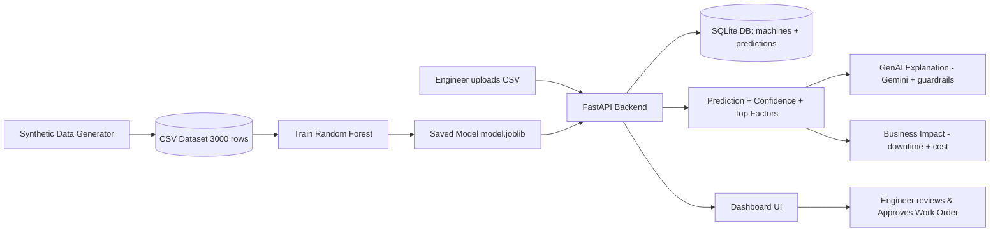
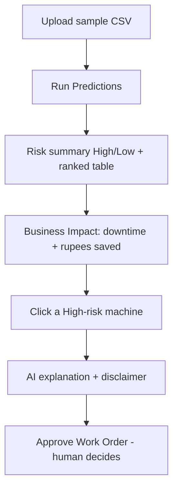

# explain.md — Complete Logic & Explanation Guide

> The single source of truth for our AI Predictive Maintenance System.
> Read this to understand **every** part of the project and to answer any judge
> question. All numbers reflect the actual running code.

---

## Table of contents
1. What the project does (one line)
2. Architecture & data flow
3. Folder structure
4. Machine Learning pipeline
5. Dataset generation logic
6. Random Forest logic
7. Prediction & confidence score
8. **Risk classification (High / Low) — full logic**
9. **Cost calculation — full formula, assumptions, example**
10. Database schema
11. API endpoints
12. Backend flow
13. Frontend flow
14. GenAI integration & guardrails
15. Security & privacy
16. **Rule compliance check (Do's & Don'ts)**
17. Design decisions (why we did what we did)
18. Demo script + judge Q&A
19. How to run
20. Known limitations

---

## 1. What the project does
**For maintenance engineers, we predict which industrial machines are likely to
fail soon** — with a confidence score, a plain-language reason, and the rupee
value of acting early — **so breakdowns are prevented before they happen.** The
AI only recommends; the engineer always makes the final decision.

---

## 2. Architecture & data flow



**Three golden rules of the architecture:**
- The **frontend never touches the database** — only through the API.
- The **LLM is never the source of truth** — ML predicts, GenAI only explains.
- The **model loads once at startup**, never retrains per request.

---

## 3. Folder structure
```
predictive-maintenance-system/
├── ml/
│   ├── config.py            # tunable settings (ranges, weights, seed)
│   ├── data_generator.py    # synthetic data logic
│   ├── generate_dataset.py  # runnable: writes CSV
│   ├── train.py             # trains Random Forest, saves artifacts
│   └── artifacts/           # model.joblib, metrics.json, feature_importance.json
├── backend/
│   ├── main.py              # FastAPI app, CORS, DB init on startup
│   ├── database.py          # SQLite engine + session
│   ├── models.py            # ORM tables: Machine, Prediction
│   ├── schemas.py           # Pydantic validation
│   ├── ml_service.py        # loads model, predicts, risk label
│   ├── cost_service.py      # downtime + cost impact
│   ├── genai_service.py     # Gemini explanation + guardrails + fallback
│   ├── crud.py              # DB read/write helpers
│   └── routes.py            # 8 API endpoints
├── frontend/                # index.html, style.css, script.js (no build step)
├── data/                    # seed dataset + demo sample
├── requirements.txt
├── .env.example             # template (real .env NOT committed)
└── explain.md, README.md
```
Each file has one job (SOLID) → four people can work in parallel and it's easy
to explain.

---

## 4. Machine Learning pipeline
1. `generate_dataset.py` → creates `data/synthetic_sensor_data.csv` (3000 rows).
2. `train.py` → splits data, trains the Random Forest inside a preprocessing
   pipeline, evaluates on a held-out test set, saves `model.joblib`,
   `metrics.json`, `feature_importance.json`.
3. Backend loads `model.joblib` once and serves predictions.

---

## 5. Dataset generation logic
- **15 machines**, 4 types (CNC, Pump, Motor, Compressor).
- Each machine → **time-series of 200 snapshots** = 3000 rows total.
- **Operating hours increase** naturally over each machine's life.
- **~Half the machines degrade** toward failure late in life.
- **Correlated degradation:** as a machine deteriorates, temperature, vibration,
  current and load **rise together** (realistic physics — a failing machine runs
  hotter, shakes more, draws more current, works harder).
- **~4% anomaly rows** with extreme values (temperature = 6000, vibration = 18,
  current = 120, load = 150) are injected and always labelled failure. This is
  crucial: a Random Forest **cannot extrapolate** beyond values it was trained
  on, so we must include extreme examples for it to flag them.
- **Reproducible** via fixed seed (42).

### The failure label (NOT random) — engineering rules + calibration
A row is `failure = 1` if **any** engineering rule fires:
- Critical single sensor: `temperature > 100` OR `vibration > 6` OR
  `current > 32` OR `load ≥ 98`.
- Impossible/sensor-fault readings (anomalies): `temperature > 150` OR
  `current > 80` OR `vibration > 12` OR `load > 120`.
- Old & neglected: `operating_hours > 15000` AND `maintenance_count ≤ 2`.
- Jointly abnormal: `temperature > 82` AND `vibration > 3.8` AND `load > 80`.

Then the highest-risk remaining rows are added (by `risk_score`) until the total
failure ratio reaches **~20%**. This keeps labels grounded in engineering logic,
always includes extreme rows, and gives an honest 20/80 class balance.

### risk_score (continuous, generation-only)
A weighted, saturating blend of how far each signal is above its healthy baseline
(temperature, vibration, current, load) plus age/environment plus small noise.
**It is stored in the CSV for analysis but excluded from model training** (it is
derived from the target → would leak).

---

## 6. Random Forest logic
- **What it is:** an ensemble of 200 decision trees; each tree votes, and the
  forest averages the votes into a probability.
- **Why we chose it:** strong on tabular sensor data, fast on CPU (no GPU),
  gives **feature importance** for explainability, deploys as one file. Deep
  learning would be over-engineering here.
- **Pipeline:** `OneHotEncoder(machine_type)` + numeric sensors →
  `RandomForestClassifier(n_estimators=200, class_weight="balanced",
  random_state=42)`.
- **class_weight="balanced"** compensates for the 20/80 imbalance.
- **Leakage-safe features (8):** machine_type, temperature, vibration, current,
  load, operating_hours, maintenance_count, ambient_temperature, humidity.
  **Excluded:** machine_id, risk_score, failure.

### Metrics (held-out test set, 600 rows)
| Metric | Value |
|---|---|
| Accuracy | 0.988 |
| ROC-AUC | 0.999 |
| Precision (failure) | 0.967 |
| Recall (failure) | 0.975 |
| F1 (failure) | 0.971 |
| Confusion matrix | TN 476, FP 4, FN 3, TP 117 |

**Top features:** vibration (0.32), temperature (0.24), current (0.11),
operating_hours (0.09), load (0.08).

**Honesty note:** high scores come from synthetic data generated by a known
process — reported as sanity metrics, not a real-world guarantee. 7 test errors
(4 false alarms, 3 missed) prove no model is perfect.

---

## 7. Prediction & confidence score
- Backend calls `model.predict_proba(X)` → **P(failure)** in [0, 1].
- **This probability IS the confidence score** shown in the UI.
- **Top factors** come from the model's global feature importances (vibration,
  temperature, current).

---

## 8. Risk classification (High / Low) — full logic

```python
def risk_label_from_proba(p):
    return "High" if p >= 0.5 else "Low"
```

**Why only two categories (High / Low)?**
- The ML target is **binary**: a machine either fails or it doesn't. The model
  outputs one probability.
- The **same 0.5 threshold** that decides the prediction also decides the label,
  so the story is clean:
  - **risk label = the model's decision** (fail vs not-fail),
  - **confidence = how sure the model is** (the probability).
- A **Medium** band would be an *arbitrary* slice of probability with **no clear
  operational meaning** — a judge would ask "what does Medium tell the engineer,
  inspect or not?" and there's no good answer. Two tiers map directly to the two
  possible actions: **inspect (High)** or **monitor (Low)**.
- Removing Medium makes the whole system — model, label, action, and cost math —
  consistent and easy to defend.

| Risk | Condition | Action |
|---|---|---|
| **High** | P(failure) ≥ 0.5 | Needs inspection |
| **Low** | P(failure) < 0.5 | Normal / monitor |

---

## 9. Cost calculation — full formula, assumptions, example

### The idea (expected value)
When a machine is flagged **High**, the engineer acts *before* it fails. This
converts an expensive **unplanned breakdown** into a cheaper **planned
maintenance**. We value that using **expected value = savings × probability**.

### The formula
```
Cost_unplanned = unplanned_downtime_hours × downtime_cost_per_hour + unplanned_repair
Cost_planned   = planned_downtime_hours   × downtime_cost_per_hour + planned_maintenance

weight = risk_tier_weight × confidence        # High = 1.0, Low = 0.0

Cost saved (per machine)      = (Cost_unplanned − Cost_planned) × weight
Downtime avoided (per machine)= (unplanned_downtime_hours − planned_downtime_hours) × weight
```
The dashboard **sums** these across all machines for the fleet totals.

### Why this formula (and not something more complex)
- It is **defensible in 20 seconds**: "the difference between a breakdown and a
  scheduled service, times how likely the breakdown is."
- Every input is a **transparent, configurable assumption** (in `cost_service.py`
  and overridable via environment variables) — not a black box.
- It uses the model's **confidence**, so a 95%-sure High machine counts more than
  a 60%-sure one. Low-risk machines contribute 0 (nothing to save).

### Assumptions (INR, configurable)
| Assumption | Value | Meaning |
|---|---|---|
| unplanned_downtime_hours | 8 h | how long a surprise breakdown stops production |
| planned_downtime_hours | 2 h | how long a scheduled service takes |
| downtime_cost_per_hour | ₹25,000 | lost production per hour down |
| unplanned_repair_cost | ₹1,50,000 | emergency parts + labour |
| planned_maintenance_cost | ₹40,000 | scheduled service cost |

### Worked example (one High machine, confidence = 1.0)
```
Cost_unplanned = 8 × 25,000 + 1,50,000 = ₹3,50,000
Cost_planned   = 2 × 25,000 +   40,000 = ₹90,000
weight         = 1.0 × 1.0 = 1.0
Cost saved     = (3,50,000 − 90,000) × 1.0 = ₹2,60,000
Downtime saved = (8 − 2) × 1.0 = 6 hours
```
A machine at 80% confidence would save `₹2,60,000 × 0.8 = ₹2,08,000`.

---

## 10. Database schema (SQLite, auto-created, no migrations)

**Table `machines`** — uploaded sensor snapshots (input store):
`id, machine_id, machine_type, temperature, vibration, current, load,
operating_hours, maintenance_count, ambient_temperature, humidity, created_at`

**Table `predictions`** — one row per prediction (audit/history log):
`id, machine_id, prediction (0/1), risk_label, confidence, top_features (JSON),
created_at`

Raw inputs and model outputs are stored separately; every prediction is logged
with its confidence + timestamp for audit.

---

## 11. API endpoints (8)
| Method | Path | Purpose |
|---|---|---|
| GET | `/health` | Service + model + GenAI status |
| POST | `/upload` | CSV → validate → store in `machines` |
| POST | `/predict` | Predict stored machines → save to `predictions` |
| POST | `/predict/single` | Predict one snapshot from JSON (not saved) |
| GET | `/api/machines` | Stored machines + live risk (feeds the table) |
| GET | `/api/impact` | Fleet downtime avoided + ₹ cost saved |
| GET | `/predictions` | Prediction history (audit log) |
| POST | `/explain` | GenAI explanation for a prediction |

Interactive docs live at `http://127.0.0.1:8000/docs`.

**Why two prediction endpoints:** `/predict` runs on stored machines and
**persists** results for audit; `/predict/single` is a quick JSON test for the
demo and does **not** persist (keeps history clean).

---

## 12. Backend flow
```
Upload CSV → validate columns/types → store rows in machines
          → Run Predictions → load model → predict_proba → risk label + confidence
          → store in predictions → return JSON
          → GET /api/machines merges sensors + risk for the table
          → GET /api/impact computes downtime + cost
          → POST /explain returns GenAI text
```

---

## 13. Frontend flow (the 3–5 click journey)

Landscape layout; the table shows the top 8 with a **Show all** button to keep it
clean.

---

## 14. GenAI integration & guardrails
**Role:** explain the ML result in plain language and recommend a next inspection
action. It **never** predicts or decides.

**What we send to the LLM (token-optimized):** only machine ID, risk label,
confidence, and top-3 factors — **never raw rows or the database**.

**Guardrails:**
1. **Scope lock** — system prompt limits answers to machine maintenance.
2. **Decision boundary** — recommend only, no final repair/replace decision.
3. **Disclaimer** — every AI output shows the decision-support disclaimer.
4. **Input validation** — structured fields only → no free-text prompt-injection
   surface.
5. **Safe fallback** — if the API key is missing or the call fails, a
   deterministic template explanation is returned (demo never breaks).
6. **Output cap** — max output tokens limited to control cost.

**Human-in-the-loop:** the engineer clicks **Approve Work Order**; the AI cannot
act on its own.

---

## 15. Security & privacy
- 100% **synthetic** data, fictional machine IDs (no real/PII data).
- **API key in `.env`**, never hardcoded, never committed (`.env.example` only).
- **Input validation** on every upload/request (Pydantic + column checks).
- **DB never exposed** to the browser — only via the API.
- **Audit log** — every prediction stored with timestamp + confidence.
- **Minimal data to the LLM** — only fields needed for the explanation.

---

## 16. Rule compliance check (Do's & Don'ts + Implementation Guidelines)

| Rule | Status | Evidence |
|---|---|---|
| Synthetic data only, no PII | ✅ | fully generated, fictional IDs |
| Repeatable generator + fixed seed | ✅ | `generate_dataset.py`, seed 42 |
| Documented target-label rule | ✅ | section 5 above |
| Realistic ranges, class imbalance, edge cases | ✅ | 20% failures, ~4% anomalies |
| No data leakage | ✅ | risk_score/failure excluded from training |
| DB with schema, not CSV/memory only | ✅ | SQLite, 2 tables, auto-init |
| Validate every upload/payload | ✅ | Pydantic + column checks, 400/422 errors |
| Store predictions with history | ✅ | `predictions` table + `/predictions` |
| Baseline + proper split + pipeline | ✅ | sklearn Pipeline, stratified held-out test |
| Right metrics (not accuracy alone) | ✅ | precision/recall/F1/ROC-AUC reported |
| Show a failed case | ✅ | 7 test errors documented (section 6) |
| Separate FE / API / ML / DB / GenAI | ✅ | modular folders |
| Health endpoint + structured JSON | ✅ | `/health`, typed responses |
| Don't expose DB to browser | ✅ | frontend only calls the API |
| GenAI grounded, not source of truth | ✅ | explains ML output only |
| Don't send whole DB to LLM | ✅ | only summary + top-3 factors |
| Structured output + fallback | ✅ | JSON response + template fallback |
| Guardrails actually implemented | ✅ | scope lock, disclaimer, validation, fallback |
| Human approval for actions | ✅ | Approve Work Order button |
| Secrets in env, no committed .env | ✅ | `.env` gitignored, `.env.example` only |
| Token optimization (minimal prompt) | ✅ | field selection + output cap |
| Don't call LLM when ML/code suffices | ✅ | ML predicts; LLM only explains |
| One-command / documented startup | ✅ | README + section 19 |
| Seed dataset ready to use | ✅ | `data/synthetic_sensor_data.csv` |
| Business impact with calculation | ✅ | expected-value cost model (section 9) |
| Don't claim 100% accuracy | ✅ | honesty note + shown errors |

**Points to state proactively in the demo (rules reward these):**
- We report precision/recall/F1, not just accuracy.
- We show a false alarm and a missed case.
- Our prompt-injection defense = structured input only (no free text to the LLM).
- We never send the database to the LLM.

**No rule violations identified.** One optional hardening (not required for the
MVP): the write endpoints are unauthenticated — acceptable for a single-user
hackathon demo, and noted as a limitation.

---

## 17. Design decisions (why we did what we did)
- **Random Forest** over deep learning → CPU-friendly, explainable, fast.
- **Two-tier risk** → matches the binary target and the binary action.
- **Engineering-rule labels + anomalies** → the model learns real failure
  patterns and flags impossible values.
- **risk_score excluded from training** → prevents leakage.
- **Expected-value cost model** → simple, transparent, defensible.
- **GenAI fallback template** → demo never depends on an external API.
- **Single-file frontend** → zero build step, reliable on any PC.
- **Model loaded once at startup** → fast inference.

---

## 18. Demo script + judge Q&A

### Live demo (7–10 min, 4 presenters)
1. **Problem & architecture (P1):** unplanned downtime is costly; our pipeline
   predicts failures early; engineer stays in control.
2. **Data & ML (P2):** 3000 synthetic snapshots, correlated degradation,
   engineering-rule labels, 20% failures, Random Forest, 0.97 F1, no leakage.
3. **Live app & impact (P3):** upload CSV → predictions + confidence → ranked
   table → business impact (downtime + ₹ saved) → enter temperature 6000, model
   flags High.
4. **GenAI, guardrails, security (P4):** click a machine → AI explanation (only
   summary + top-3 sent) → disclaimer, scope lock, fallback → engineer approves
   work order → keys in .env, inputs validated, audit log.

### Judge Q&A
- **What do you send the LLM?** Only ID, risk, confidence, top-3 factors — never
  raw rows/DB.
- **Leakage?** risk_score/failure excluded; stratified test; P/R/F1 reported.
- **98% too high?** Synthetic sanity metric, not real-world; we show 7 errors.
- **Gemini down?** Deterministic fallback template.
- **Cost justified?** Expected value: (unplanned − planned) × probability.
- **Can AI act alone?** No — human approves; disclaimer on every output.
- **Why Random Forest?** CPU-friendly, explainable, strong on tabular data.
- **6000°C handling?** Extreme anomalies injected + labelled failure → flagged
  High.
- **Why only High/Low?** Binary target → binary action; Medium had no clear
  meaning.

---

## 19. How to run
```bash
pip install -r requirements.txt

# (optional) regenerate data + retrain
python -m ml.generate_dataset
python -m ml.train

# start backend (keep running)
python -m uvicorn backend.main:app --reload      # http://127.0.0.1:8000/docs

# open the dashboard
# double-click frontend/index.html
```
Upload `data/sample_data_25.csv` for a clean demo.

---

## 20. Known limitations (be honest)
- Synthetic data only — not validated on real factory sensors.
- Metrics are optimistic (data generated from known rules).
- GenAI uses a fallback template if no live API key is configured.
- Cost figures are illustrative assumptions, not audited financials.
- Single-user demo — no authentication (out of MVP scope).

---
*End of explain.md — everything here matches the code and can be defended live.*
